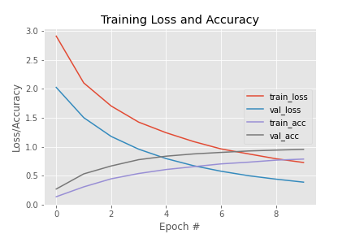

# Human Activity Recognition

A wed application which based upon deep learning 
model, which takes input from per-recorded video 
footage and recognise human activities using 
Convolutional neural network(CNN) and Long-Short term 
memory(LSTM)

## Prerequisites

Make sure you have already installed:

Python version 3.8 

TensorFlow 2 

OpenCV – 3.4.16 

keras 2.6.0 

All the frames extracted from videos were re-sized to 224 × 224 shape to feed the to the model.

## Data Set

UCF101 dataset

UCF101 is an action recognition data set of realistic action videos, collected from YouTube, having 101 action categories. This data set is an extension of UCF50 data set which has 50 action categories.

## Achitecture

A convolutional neural 
network extracts the features of the video while an LSTM neural network classifies 
the video into a certain category.

## Accuracy

## System used

Intel CORE i5-10300H CPU computer with 8GB 
DDR4 memory and Ubuntu Operating System 16.04. The experiments were carried 
out on an NVIDIA GeForce GTX 1650 4GB mounted on a local system
